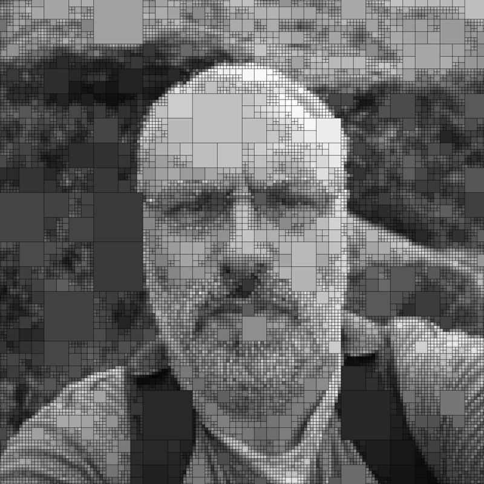

I am an architect and computational designer, co-founder of [Co-de-iT](https://www.co-de-it.com) - Computational Design Italy. I teach international workshops on computational design, digital tools, and robotic fabrication in architecture. I also consult for industry and research institutes.
Additionally, I co-founded [FabLab Torino](https://fablabtorino.org) and [digifabTURINg](https://digifabturing.tumblr.com), a research cluster focused on digital fabrication and material research in architecture, design, and art. As a digital explorer and knowmad, I aim to research and envision the convergence of science, technology, and art in design and architecture.

